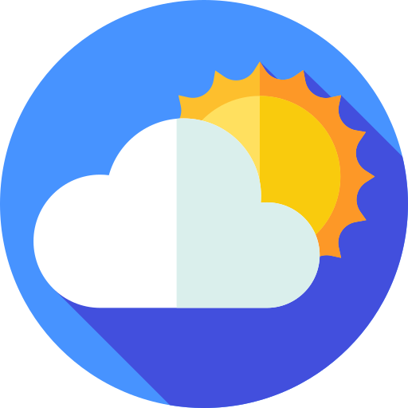
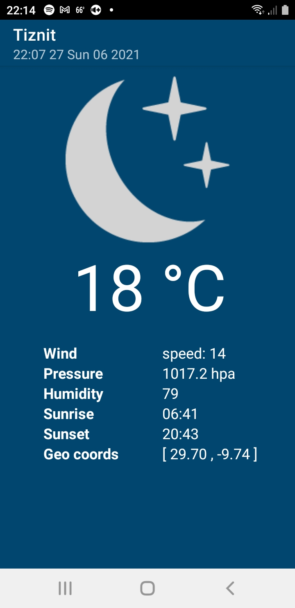
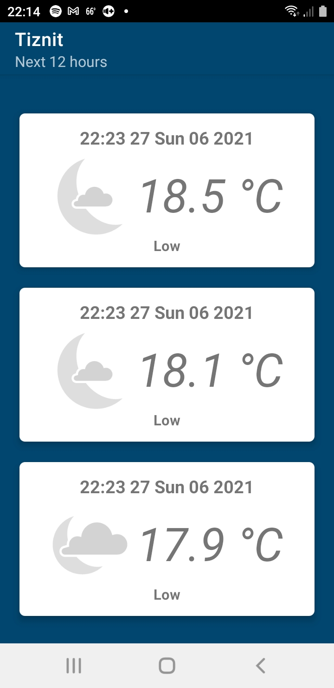
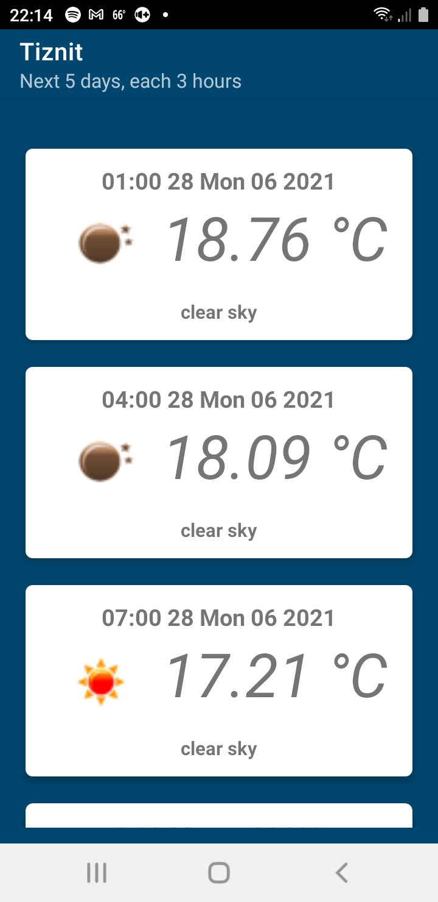

# Weather

## Table of Contents
* [General Info](#general-information)
* [Technologies Used](#technologies-used)
* [Screenshots](#screenshots)

## General Information
- An Android weather application uses your current location to display current, next 12 hours, and next 5 days weather informations.

- It is implemented using the MVVM pattern, Retrofit2, Rxjava, LiveData, ViewModel.
- Instant Weather fetches data from the [OpenWeatherMap API](https://openweathermap.org/api) and [IBM Cloud](https://developer.ibm.com/devpractices/api/blogs/call-for-code-the-weather-company-and-you/) to provide real time weather information.

## Technologies Used
* [Retrofit](https://square.github.io/retrofit/)
* [Rxjava3](https://github.com/ReactiveX/RxJava)
* [ViewModel](https://square.github.io/retrofit/)
* [Picasso](https://square.github.io/picasso/)
* [LiveData](https://developer.android.com/topic/libraries/architecture/livedata)
* [Google Play servises](https://developers.google.com/android/guides/setup)

## Screenshots
<table>
  <tr>
    <td></td>
    <td></td>
    <td></td>
  </tr>
 </table>